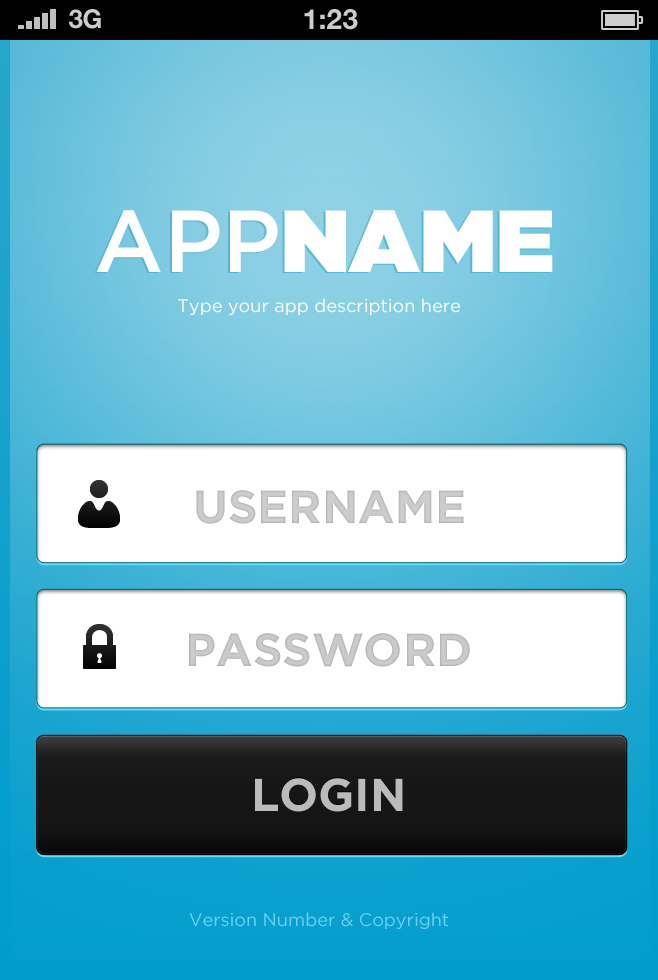
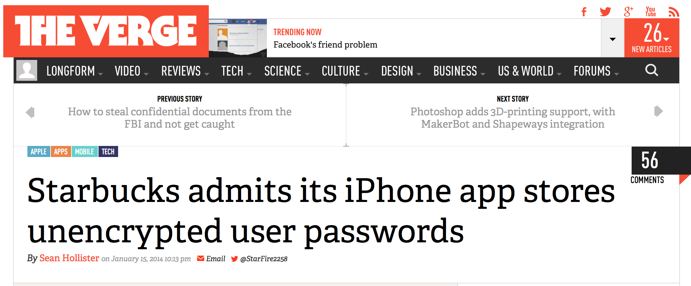
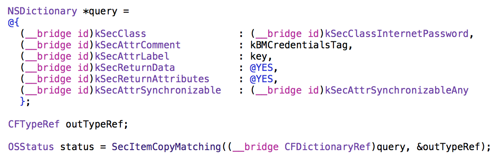
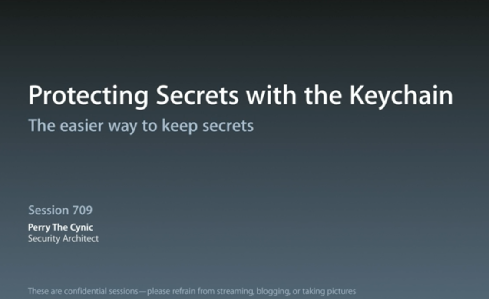
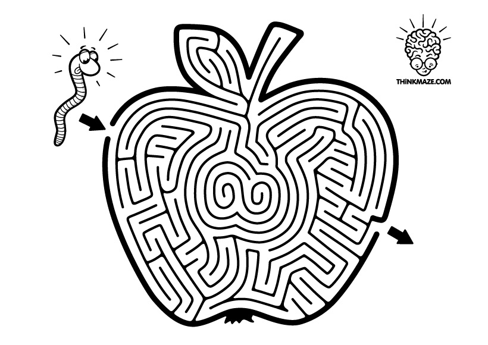
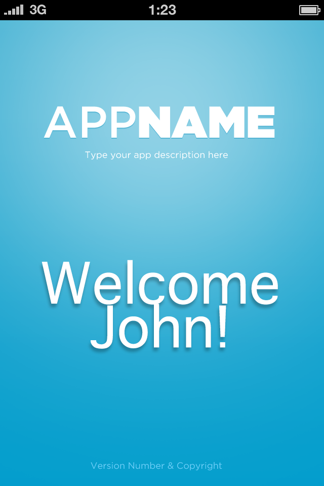
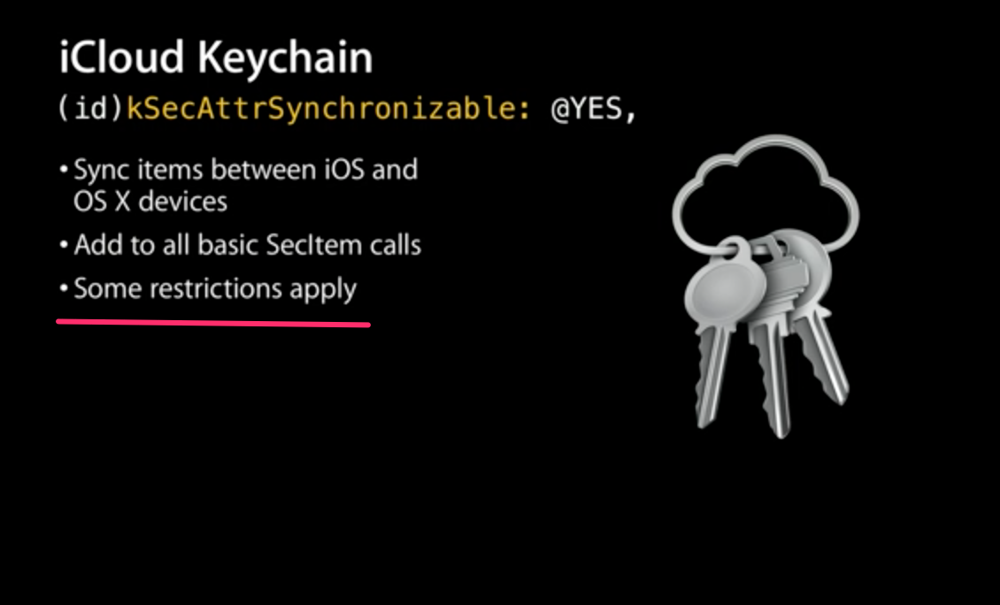
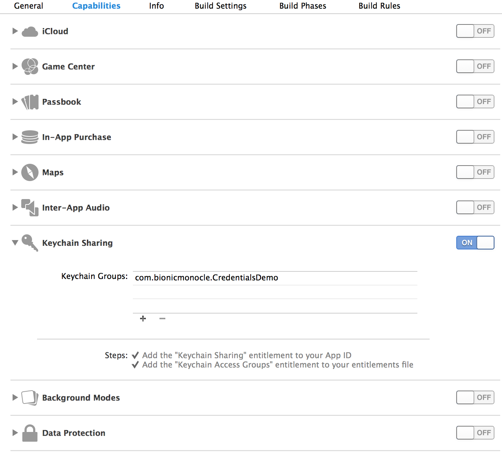

^I'm Adam. Bionic Monocle, an iOS app development company. I'm going to talk to you briefly about a library that will make handling credentials easier for you and more secure for your users

## BMCredentials

### Adam Iredale

---

^ Every app...
^ Most apps have one of these
^ User enters username and password
^ To be part of your wonderful service
^ You save them
^ To do this, perhaps you use the iOS keychain
^ Perhaps you...

---
^ ...suffer terrible embarrassment and possible lawsuits
^ (pause)
^ Why? Because the keychain API has a relatively steep learning curve...

---
^ not very forgiving for mistakes
^ not documented very well

---
^ in short, it's ugly

---
^ last WWDC session 709 called...
^ it taught us that
^ once you get to know it, the keychain api isn't that ugly
^ it's what's on the inside that counts

---

^ even if it IS hidden under layers of obscure code with even more obscure docs

---

^ what's inside is best security for users
^ and automatic iCloud sync convenience
^ but how do you get the benefits without having to wrangle with the keychain api?
^ without drudging through forums and videos for undocumented features?
^ A: have someone else do it

# Secret Benefits of iOS Keychain

- Best security for users
- Automatic iCloud sync

---
^ that's where BMCredentials comes in
^ I wrote BMCredentials because there is nothing else available that does
^ single or multiple user credentials
^ iCloud Keychain sync
^ correct SecItem api usage

# BMCredentials

- Single or multiple credentials management
- iCloud Keychain sync
- Correct SecItem API usage

---
^ all the keychain wrangling has been done for you
^ square-bracketed comfort zone
^ the interface is all ObjC
^ has iCloud Keychain sync built in

# BMCredentials

- No Keychain API wrangling required
- Objective-C interface
- iCloud Keychain sync built in

---
^ Here's an example of how easy it is to use BMC in your app
^ Your app starts up on John's iPhone
^ first thing = check for credentials
^ first time - won't find any
^ so you show a login screen (when and where is another matter entirely)

# Usage Example: John's iPhone

---

# Usage Example: John's iPhone

	NSError *error = nil;
	
	BMCredentials *credentials = [BMCredentials defaultCredentials:&error];
	if (!credentials)
	{
		// All the error codes are passed through directly from the SecItem API
		if (error.code == errSecItemNotFound)
		{
			// SHOW LOGIN SCREEN
		}
		else
		{
			// Drat
		}
	}

---
^ John types in his username and password
^ in this case you may not need a url - that's fine
^ Assuming all goes well, credentials are stored in the keychain

# Usage Example: John's iPhone

	BMCredentials *credentials = [[BMCredentials alloc] init];
	
	credentials.username 	= @"john.appleseed";
	credentials.password 	= @"heartbleed_sucks_i_need_a_stronger_password";
	credentials.url			= [NSURL URLWithString:@"https://somewebservice.com"];
	
	NSError *error = nil;
	if (![BMCredentials setDefaultCredentials:credentials error:&error])
	{
		// ...
	}
	
---
^ So the next time app it will find the credentials
^ and not show the login screen. great.
^ For a simple app, that's all there is to it.
^ let's expand this example a bit
^ say writing, universal app (iPad and iPhone)
^ want make your user experience "magical"
^ you use the same code (I hope) copy paste ugh
^ one minor change

---
^ we enable cloud sync

# [fit]credentials.enableCloudSync = YES;
	
---
^ So this time...
^ John types in his username and password...

---
^ credentials are stored locally...

	credentials.username			= @"john.appleseed";
	credentials.password			= @"heartbleed.sucks";
	credentials.enableCloudSync 	= YES;

---

---
^ and then, a few seconds later John picks up his iPad
^ the credentials have beaten him there.
^ It's almost that simple
^ I say almost - because as said in the wwdc vid

---
^ some restrictions apply
^ but I think you'll find them manageable

---
^ so in addition to setting enableCloudSync on credentials you want to sync
^ and calling one of the available setter class methods
^ your app will need to have the Keychain Sharing entitlement enabled

# Using BMCredentials with iCloud Keychain : Code

- credentials.enableCloudSync = YES
- setDefaultCredentials or setCredentials:forKey

---
^ Which looks like this, and it's on in the demo project too

---
^ finally, 
^ users
^ if you can manage that, your users will never need to sign into your app more than 1 time
^ provide them a magical cloudy experience
^ so how do you get it?

# Using BMCredentials with iCloud Keychain : Users

- Users must be signed in to iCloud
- Users must have iCloud Keychain turned on

---

^ It's a CocoaPod
^ If you follow me on Twitter you'll know that I love CocoaPods
^ anyone not know what a cocoapod is?
^ visit coocapods.org and find out what you're missing

# CocoaPods!
## cocoapods.org

---
^ just add this line to your podfile
^ try for instant demo project

# CocoaPods!

 
    pod "BMCredentials"
    
## Terminal

    > pod try BMCredentials

---
^ I'm iosengineer on twitter and github
^ if you have issues happy to help
^ or just say hi
^ demo? hassle me

# Questions? Comments? Pull requests?

**Adam Iredale**

   @iosengineer

